# 🥤 Cooolers - Non-Alcoholic Cocktails Delivery App 🚀

Cooolers is **a native Android application** built using **Kotlin**. It allows users to order non-alcoholic cocktails, but just for non-alcoholic drinks. 

## 📱 Features

- 📝 **User Registration**: Sign up and log in using Firebase Authentication.
- 📍 **Precise Location Service**: Add and easily manage delivery addresses.
- 🍹 **Explore Drinks**: Browse through a diverse list of non-alcoholic cocktails.
- 📋 **Detailed Product View**: View detailed information about each drink.
- ⚙️ **Customization Options**: Choose drink size (small, medium, large), add extras like extra soda, syrup, or Cooolers magic.
- 🛒 **Cart Management**: Adjust quantities and view cart details.
- 📄 **Order Summary**: Review your order details before placing it.
- ✅ **Order Confirmation**: Receive an order ID and confirmation on screen.
- 📜 **Order History**: View past orders.
- 🔧 **User Settings**: Change password, phone number, address, and more.
- 📡 **Live Order Status**: Real-time updates on order status (confirmed, ready, delivered).

## 🛠️ Technologies Used

- **Kotlin**: For native Android development.
- **Firebase**: Realtime Database for order details, Firebase Storage for images, and Firebase Authentication for user management.
- **Google Places API**: For precise location services.

## 📸 Screenshots

  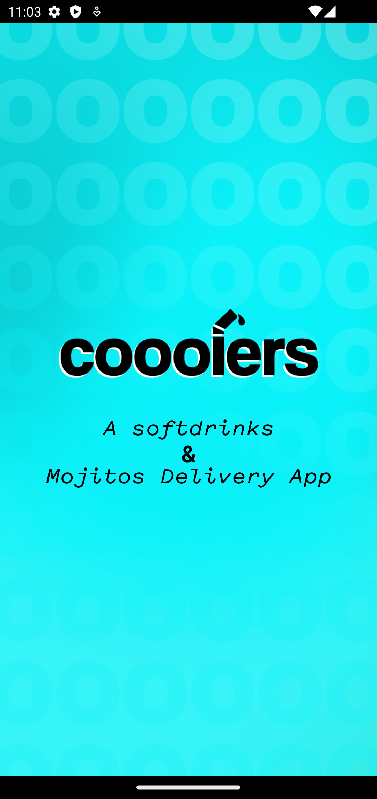
  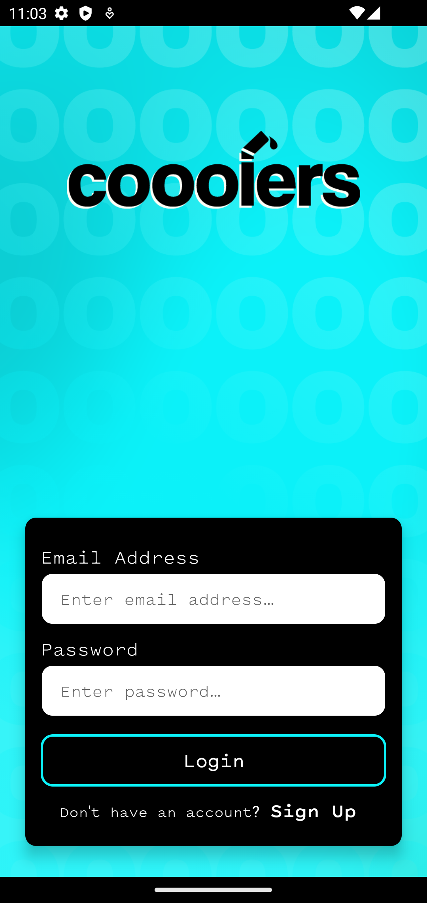
  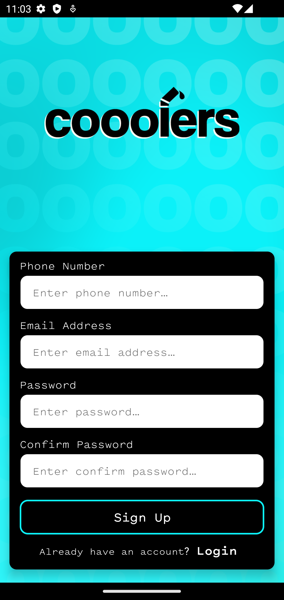
  
  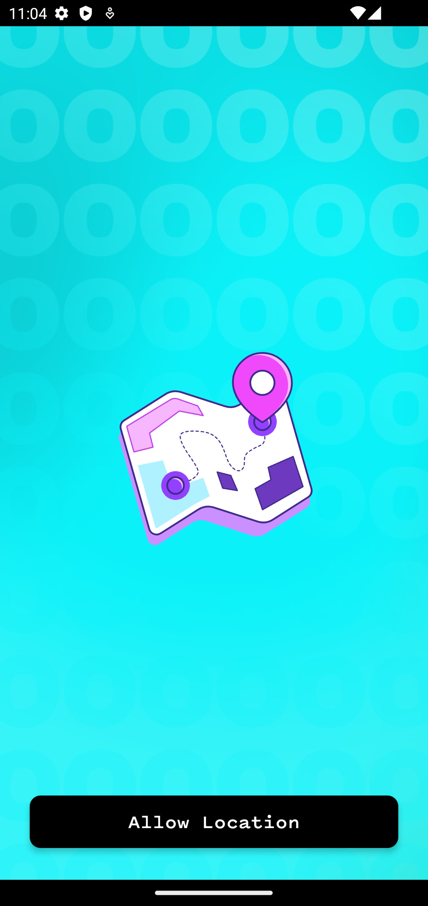
  
  
  
  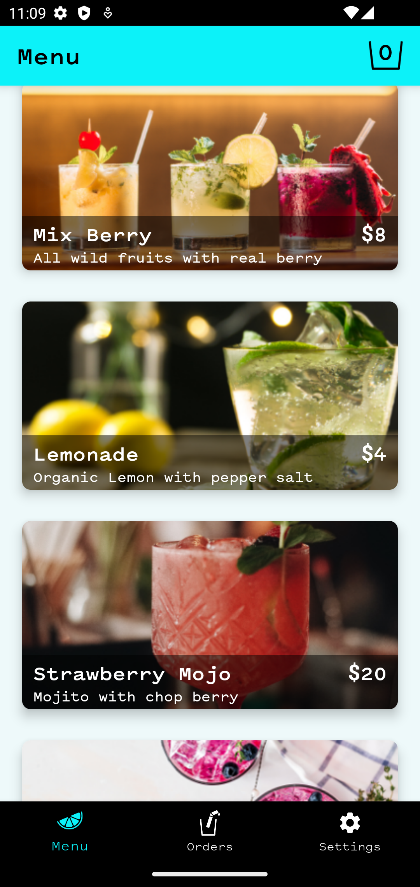
  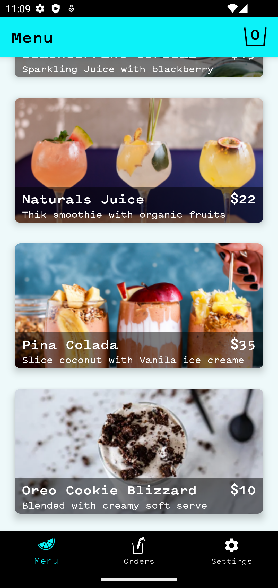
  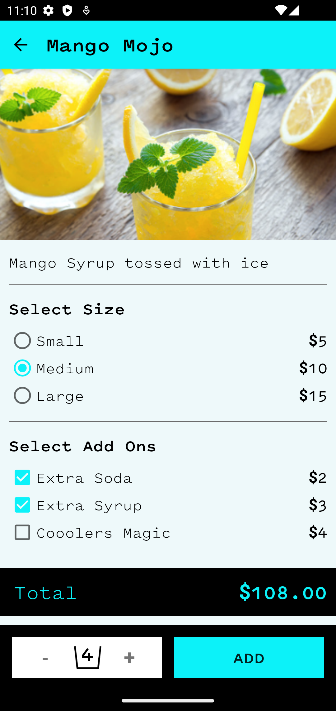
  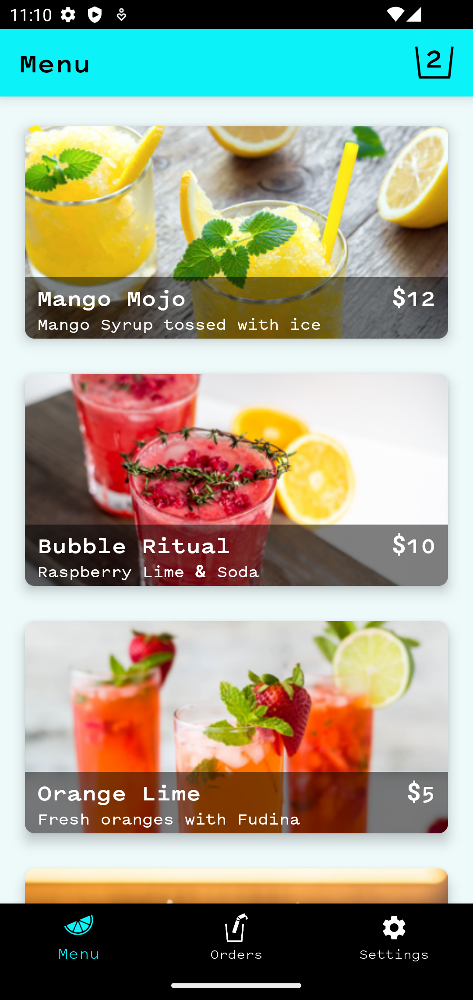
  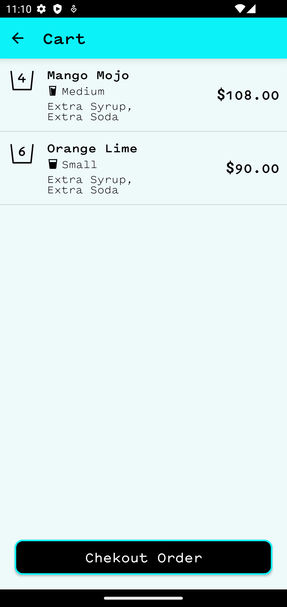
  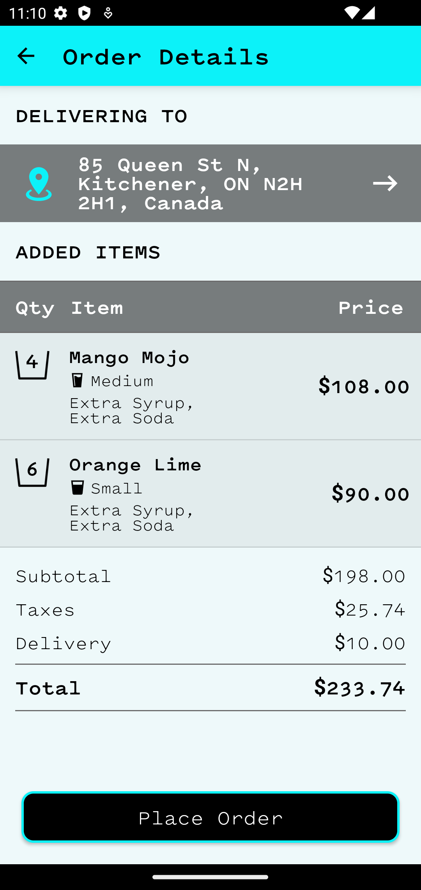
  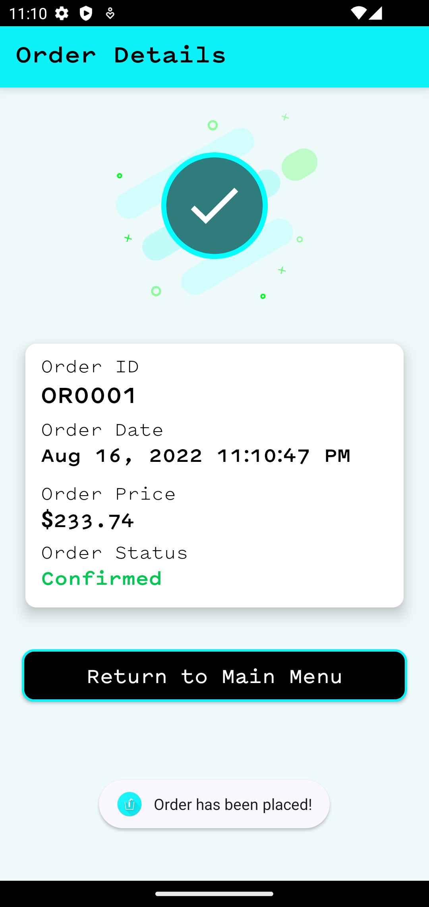
  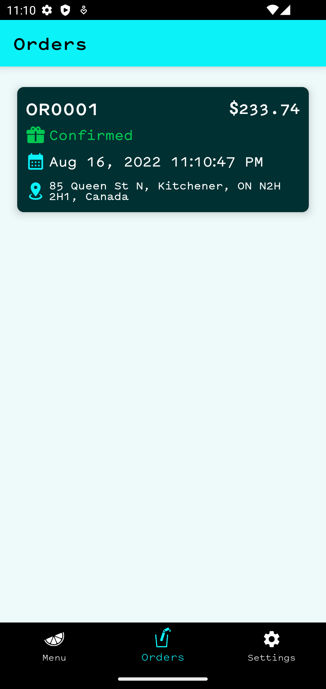
  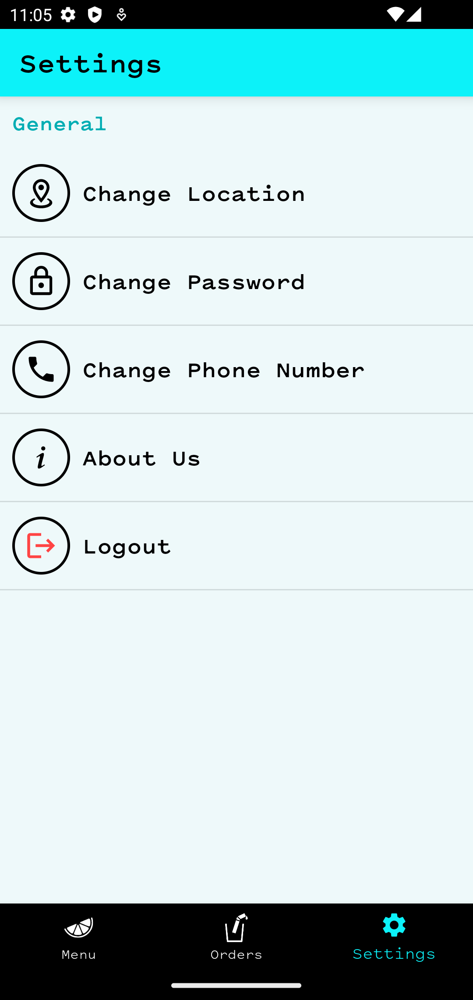
  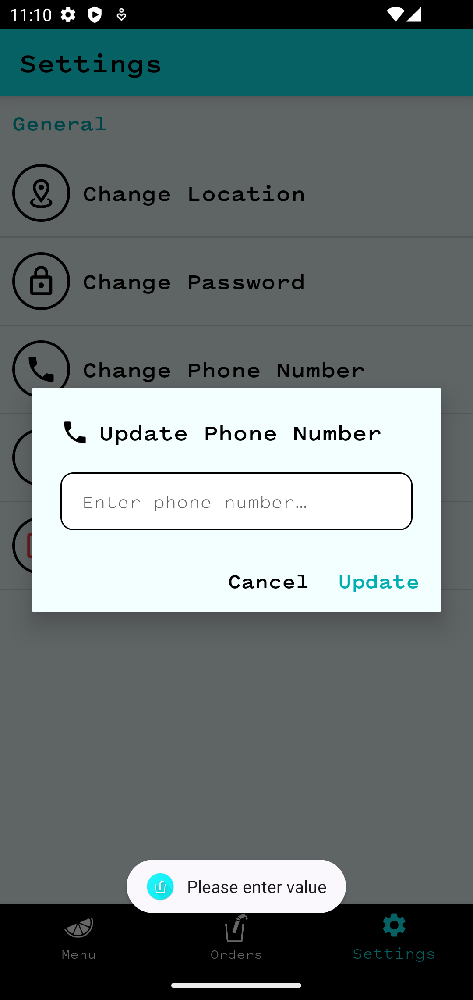
  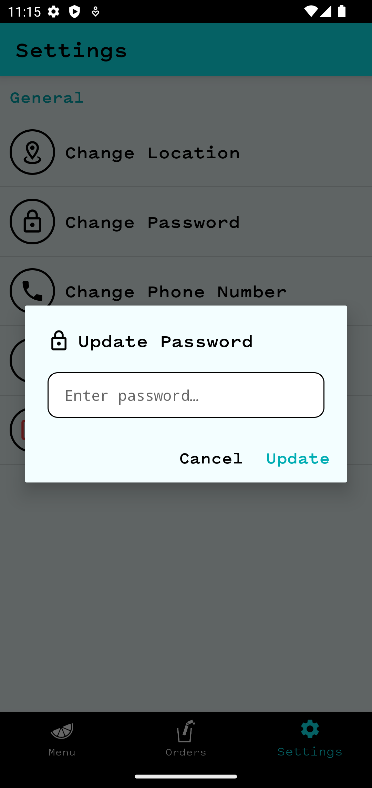
  
  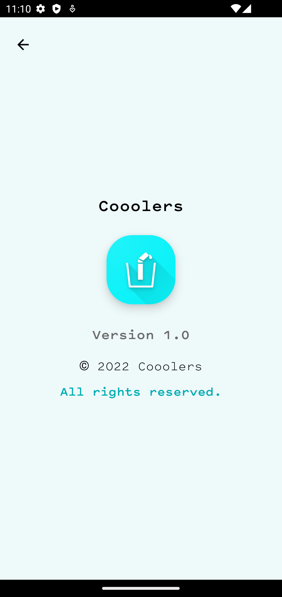

## 🔥Firebase Database

  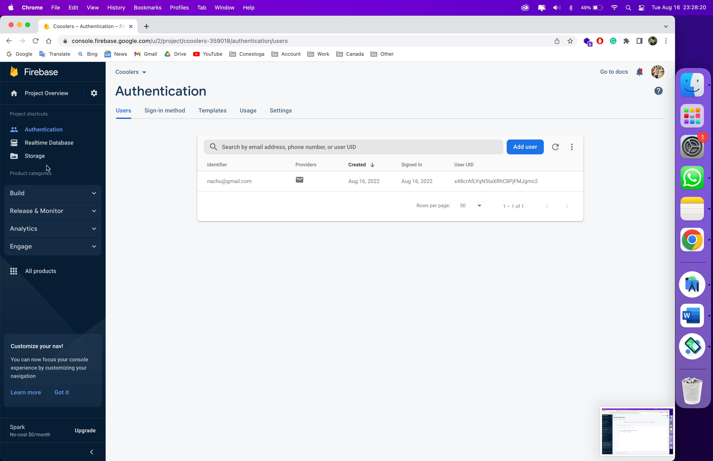
  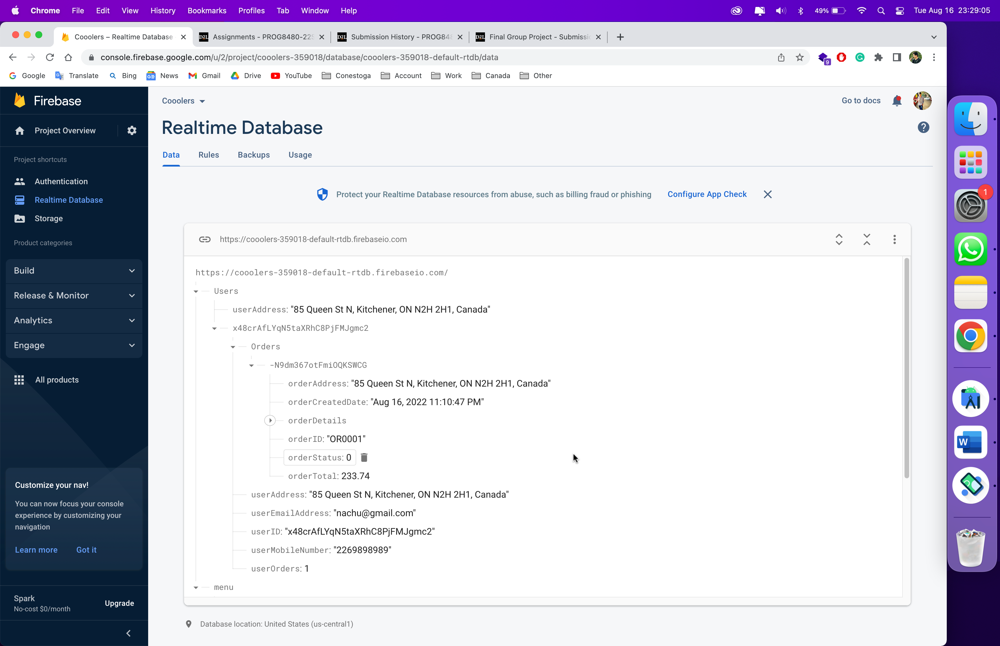

---

**Enjoy your refreshing non-alcoholic cocktails with Cooolers!**
